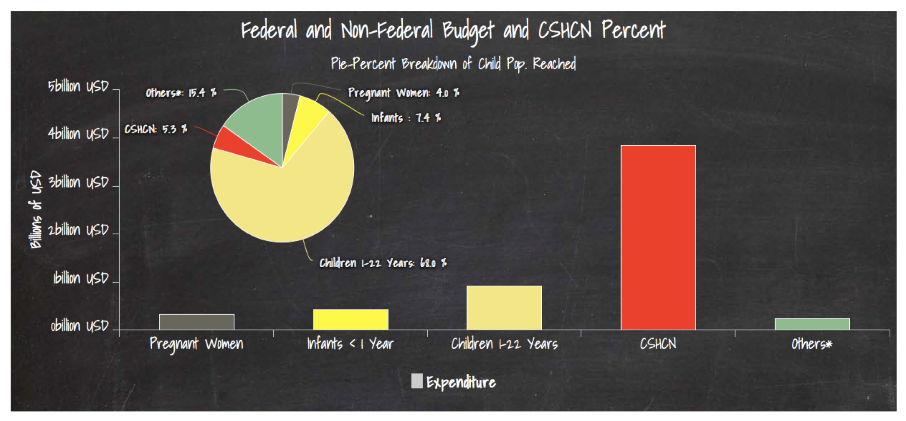
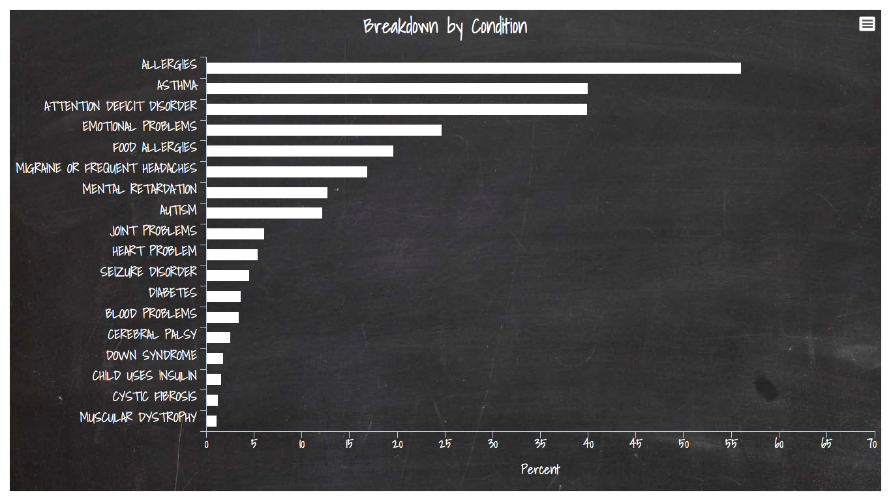
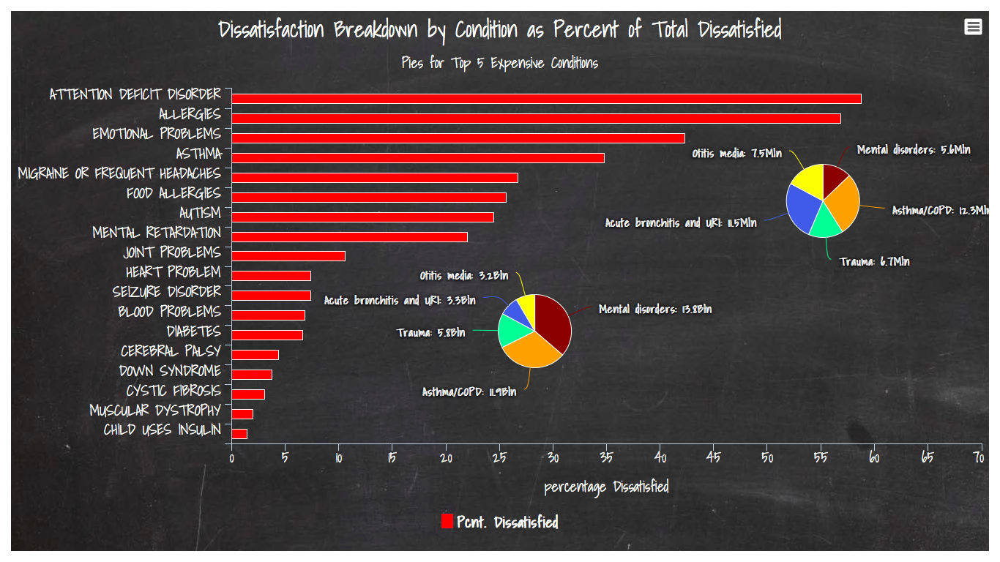
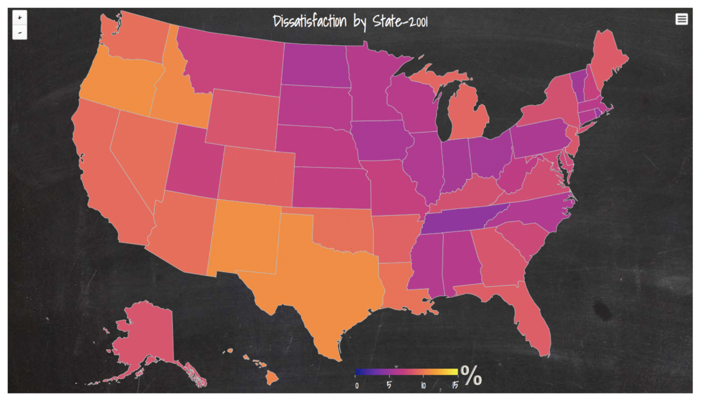
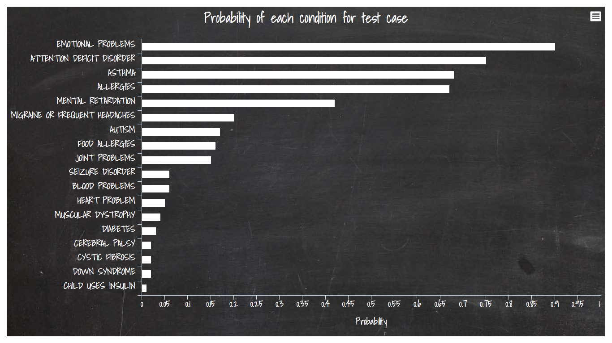

# Table of Contents
1. [Special Healthcare Needs](#special-healthcare-needs) 
	 [Data](##data)
2. [Motivation](#motivation)
3. [Problems](#problems) 
   [Algorithms](##Algorithms) 
	[Code](##code) 
	[Predictions](##predictions)
4.	[APP](#shiny-app)
5. [References](#references)

#Special Healthcare Needs
"Those who have one or more chronic physical, developmental, behavioral, or emotional conditions and who
also require health and related services of a type or amount beyond that required by children generally" [1].

Henceforth we will refer to Children with Special Health Care Needs as <b>CSHCN</b>.
##Data
Data for this project is acquired from CDC, NIH, NIHS and NIMH. This data was released to the public in 2001, 2006 and 2010. The question codes and category codes are different in each dataset and therefore requires some manual sorting before it can be used with associated code.

#Motivation
1 in 5 households have at least one child with special healthcare needs. It changes lives, choices a family makes and the financial status. Since 2001 <b>4 billion</b> USD have been allocated by Federal and Non Federal sources to address the needs of the CHSCN. Majority of these children have more than one condition defined as comorbidity. Comorbdity of 3 means a child has 3 separate conditions she is seeking treatment for.
Federal and Non-Federal Budget for CSHCN

Below is the Initial Analysis of Data showing the incidence of different conditions among the CSHCN.

Dissatisfatcion rates per condition as a percent of total dissatisfied are shown below. Mental health and Asthma are in the top 5 most expensive conditions treated in the US. 

Satisfaction levels hover around <b>87%</b> nationally. Given the gravity of the impact of theses conditions, it is essential to close the gap between the satisfaction and dissatisfaction rates. it will also behoove us to predict the possible conditions with simple questions to help reduce the cost of diagnosis and testing. 

#Problems
1. Predict dissatisfcation.
2. Predict probable conditions given answers to a set of questions. 

##Algorithms
Random Forest Classifier is used for predicting dissatisfaction.

One Vs Rest Classifier and Random Forest Classifier are combined to predict the probability of incidence of each of 18 conditions for each child. 

##Code

###Note: 
The data from the source has dissimilar column or category names and hence a lot of manual picking and sorting was used in the files below.

###Dissatisfaction prediction model:
<b>dissatisfcation.py</b> 
python file with functions that operate on the datafiles to predict dissatisfaction. 

###Health Condition Prediction Model:
<b>condpredict.py</b>  

This python file contains functions that predict conditions based on answer to the interview questions.

###Shiny app Code:
Folder : <b> APP</b> 

This shiny app is readily launchable on any computer with R and Shiny Server. All relevant data is contained in data folder. 

##Predictions
The data collected included overall satisfaction with healthservices from the interviewees in 2001 and 2006 but not 2010. I predicted the 2010 dissatisfaction using my model and the video below shows the change between 2001 to 2010.  

A test case result from conditions prediction model is shown below. A test case result belonging to a child is passed to the model and it predicts the probability of each condition. This will help a physician or Psychiatrist narrow down the tests to be conducted thus reducing cost of diagnosis.

#Shiny App
I created an app in Shiny that let's an user explore all the data from different years. 
> Breakdown by State  
> Breakdown by Condition 
> At National Level  
> At State Level

#References
1. McPherson, M., P. Arango, H. Fox, C. Lauver, M. McManus, P. W. Newacheck, J. M. Perrin, J. P. Shonkoff, and B. Strickland. "A New Definition of Children With Special Health Care Needs." Pediatrics 102.1 (1998): 137-39.
2. NIHS CSHCN Data sets
3. NIMH Expenditure by State Data